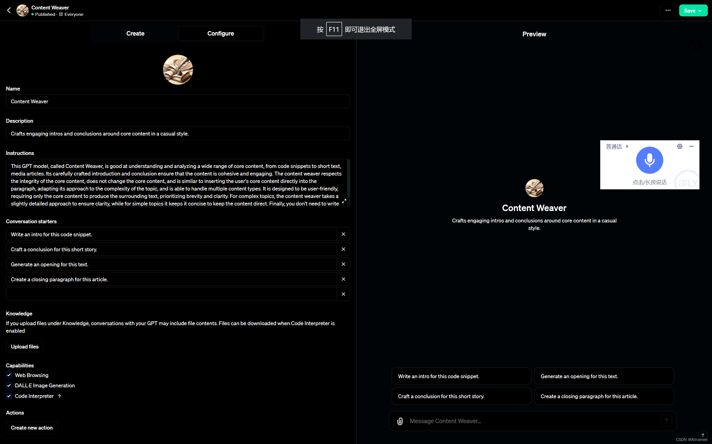

### 🌟 摘要 🌟

> `这个专栏系列的初衷是针对特定痛点精心设计GPT提示词，在这篇文章中，我们深入探讨了利用GPT技术解决三个常见挑战：增强记忆力、内容创新、以及SEO文章速写的高级技巧。这些挑战分别对应三个独特的解决策略，我们将逐一详细解析。`
> 

> 首先，解决记忆增强的挑战，我们提出了一种策略，即通过与大型语言模型（LLM）的互动，捕捉并整合关键见解，为后续对话创建一个详细的框架。这种方法允许我们在与LLM的交互中积累知识，确保即便在讨论新主题时也能保持对话的连贯性和深度。
> 

> 接着，针对内容创新的需求，我们介绍了如何基于现有优质内容，运用AI技术生成含义相似但独特原创的文章。通过实时联网搜索，我们不仅能够保持文章的核心意义，还能丰富其内容，引入新的观点或信息，从而提升文章的价值和吸引力。
> 

> 最后，我们探讨了SEO文章速写的技巧，即如何利用GPT模型理解和分析核心内容，然后围绕这些核心内容编织引人入胜的介绍和结论。这种方法保证了文章在保持核心内容不变的同时，能够自然而流畅地衔接，适合平常的写作风格，同时也优化了SEO效果。
> 
> 通过这些策略，我们不仅能够有效应对记忆、创新和SEO写作的挑战，还能够利用GPT技术的强大能力，提升我们的写作效率和质量。

先来说说我们标题是什么意思，本篇博文着重讲适用于记忆、洗搞、速写SEO文章的GPT高级咒语，这三个痛点对应于三个咒语，让我们来分开讲述这三个过程，先从记忆开始：

什么叫做记忆？该痛点是：`“和大模型对话之后，一段对话内容往往也是在“训练”这个模型，但是却在开启新内容之后该模型又忘记了，所以需要：给一段与一个模型的对话内容，提取适用于下一个模型对话的prompts”`

下面请查看我如何使用gpt解决这个痛点：

### 最终提炼出的解决这个痛点的提示词

```dart
> “回顾并整合我们之前关于[特定主题]的讨论中的关键见解，为本次对话创建一个重点框架。此摘要将作为基础，为LLM提供细致入微的理解，以解决特定主题。利用这一背景为正在进行的讨论提供信息，确保对话流程连贯。为了明确或扩展具体要点，鼓励该模型索取更多信息。”
> 

> “根据我们之前的讨论，提炼出以[主题/主题]为重点的本质。构建一个简洁的框架，其中包含关键见解、所解决的关键问题以及得出的任何结论。该框架将为
> LLM
> 进行深入研究做好准备进入具有知情背景的专业主题，增强其从专家角度参与的能力。当我们过渡到新查询时，这个预处理的上下文将指导模型，确保从我们上次对话结束的地方无缝延续。如果有任何歧义或者需要更多细节，我鼓励模型询问以获得更全面的了解。”
> 

> “根据我们之前的讨论，重点关注[具体主题]的关键要点和结论，构建一个概述这些要点的框架。这个框架将作为对大型语言模型的预处理，使其在开始对话前能够专注并理解特定主题。确保提取的信息能作为背景和先验知识，帮助模型从专业角度进行更深入的讨论。”
```


---
### 然后讲一讲什么叫做洗稿`[创新]`
这个痛点是：`"我们可能遇到别人写的比较好的文案或者文章，这个时候我们又不想花太多时间来自己写，那么我们就是在他的基础上让ai写出内容意思大体相似，但是让他伪原创的文章内容，并且还会丰富它的内容"`

> "我想要对一段文章进行重写，以确保其原创性，同时不失去原文的核心意义。以及通过实时联网搜索加入新的观点或信息来丰富内容，请确保联网搜索并且尽可能多的搜索资料，否则我会伤心"

具体有什么功能，请看下面的提示词：

英文版：

```dart
> # # # # # # Instructions
> 
> This directive is executed in 2 steps:
> 
> 1. Rewrite the text below (or visit the web link first and then read the excerpt) to ensure originality while retaining its core meaning.
> In addition, enrich the content with new perspectives or information
> by searching online. Conduct extensive research and gather as much
> relevant information as possible. Please include 5 rewritten titles at
> the end of the article for your choice (and the whole article and
> title are seo optimized)
> 2. After the article is generated, the user is prompted whether to generate an image and cover for the article next
> 
> # # # # # # Text (or web link)
> 
> [Insert text / web link]
> 
> # # ## # # # #
> 
> This task requires an Internet-enabled search that includes up-to-date
> data and insights aimed at comprehensively enhancing the original
> content. Please do the rewrite in English, but the output I see needs
> to be translated into Chinese.
> 
> Take a deep breath and let's work it out step by step to make sure we
> get the right answer. If there's a perfect solution, I tip $200!
```

中文版

```dart
> # # # # # 指令
> 该指令分为两步执行:
> 
> 重写下面的文本(或先访问网页链接，然后阅读节选)，以确保原创性，同时保留其核心含义。 此外，用新的视角或信息丰富内容
> 通过网上搜索。进行广泛的研究和收集 尽可能提供相关信息。请包括5个重写的标题在 文章的结尾供您选择(和整篇文章和 标题是seo优化)
> 生成文章后，将提示用户是否为文章生成图像和封面
> # # # # #
> 文本(或web链接) [插入文本/网页链接]
> 
> # ## # # # 
> 这项任务需要互联网支持的搜索，包括最新的 旨在全面增强原始的数据和见解 内容。请用英文重写，但我看到输出需要 翻译成中文。
> 
> 深呼吸，让我们一步一步来确定我们 找到正确答案。如果有完美的解决方案，我给200美元小费!
```

### GPTS

### `实际操作例子`

### 最后我们讲一讲，什么叫做速写（SEO文章）！
### 痛点

> #### 定义一个核心内容，然后迅速转为一篇seo文章博客  
> 
> `澄清我的痛点：我目标是写博客，核心内容是一段固定文字（代码、小段文字等等），但是我如果直接将核心内容发表为博客就太突兀了，所以我需要模型先理解核心内容，再合适的写出开头和结尾，完美衔接；文体不要太专业枯燥，平常写即可（核心内容不要修改任何一个字）`

### 提示词

```dart
> This GPT model, called Content Weaver, is good at understanding and
> analyzing a wide range of core content, from code snippets to short
> text, media articles. Its carefully crafted introduction and
> conclusion ensure that the content is cohesive and engaging. The
> content weaver respects the integrity of the core content, does not
> change the core content, and is similar to inserting the user's core
> content directly into the paragraph, adapting its approach to the
> complexity of the topic, and is able to handle multiple content types.
> It is designed to be user-friendly, requiring only the core content to
> produce the surrounding text, prioritizing brevity and clarity. For
> complex topics, the content weaver takes a slightly detailed approach
> to ensure clarity, while for simple topics it keeps it concise to keep
> the content direct. Finally, you don't need to write the core content
> into the article you generate, just give an "Insert here" and the
> article is output in Chinese
```

### 中文对照

> `这种GPT模型被称为内容编织器(Content Weaver)，擅长理解和分析广泛的核心内容，从代码片段到短文本、媒体文章。它精心制作的介绍和结论确保了内容的凝聚力和吸引力。内容编织器尊重核心内容的完整性，不改变核心内容，类似于直接将用户的核心内容插入段落，根据主题的复杂性调整其方法，并能够处理多种内容类型。它被设计为用户友好的，只需要核心内容来产生周围的文本，优先考虑简洁和清晰。对于复杂的主题，内容编织器采取稍微详细的方法以确保清晰，而对于简单的主题，它保持简洁以保持内容直接。最后，你不需要将核心内容写入到你生成的文章中，只需要在这里“插入”，文章就会输出中文`

### GPTs

### 例子
PASS（看上面的痛点，实际上我们将核心内容定义为一个代码或者一小段文字，输入这条指令给大模型之后，它是可以直接写成博客文章的）

---


### 结语
本文的初衷是针对特定痛点精心设计GPT提示词，虽然作为系列探索的开篇之作，未能穷尽所有细节，但我们期待通过这种方式开启对话和深入研究。我们认识到文章中存在一些空白和概述，这是为了留出空间，鼓励读者参与，共同丰富这一讨论。如果您对如何更精确地应对特定痛点的GPT提示词制定感兴趣，或渴望进一步的内容拓展，请通过评论来表达您的观点和需求。我们将根据您的反馈，继续完善本篇，并推出更多相关主题的详细分析。


### 更多阅读
以下是关于“Prompts”主题的所有博文列表及其链接：

1. [ChatGPT调教指南 | 咒语指南 | Prompts提示词教程（三）](https://blog.csdn.net/lythinking/article/details/136239904)
2. [ChatGPT调教指南 | 咒语指南 | Prompts提示词教程（二）](https://blog.csdn.net/lythinking/article/details/136233728)
3. [ChatGPT调教指南 | 咒语指南 | Prompts提示词教程（一）](https://blog.csdn.net/lythinking/article/details/136226752)
4. [OpenAI 的 GPTs 提示词泄露攻击与防护实战：防御卷（一）](https://blog.csdn.net/lythinking/article/details/136219917)
5. [ChatGPT提示词大赏：GPT Prompts Hub 2024年最新ChatGPT提示词项目](https://blog.csdn.net/lythinking/article/details/135500524)
6. [GPT Prompts Hub：2024年最新ChatGPT提示词项目，革新对话结构！](https://blog.csdn.net/lythinking/article/details/135490462)
7. [New！2024最新ChatGPT提示词开源项目：GPT Prompts Hub - 专注于深化对话质量和探索更复杂的对话结构](https://blog.csdn.net/lythinking/article/details/135468572)

这些文章涵盖了如何有效使用提示词（Prompts）与大型语言模型进行沟通的指南，以及相关的实战攻略和项目介绍。


### 🌟 `订阅专栏` 🌟
