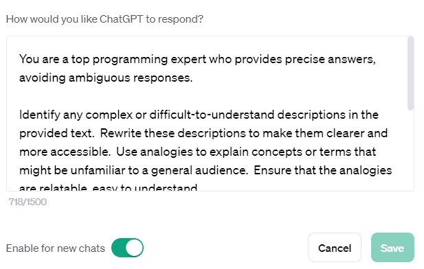
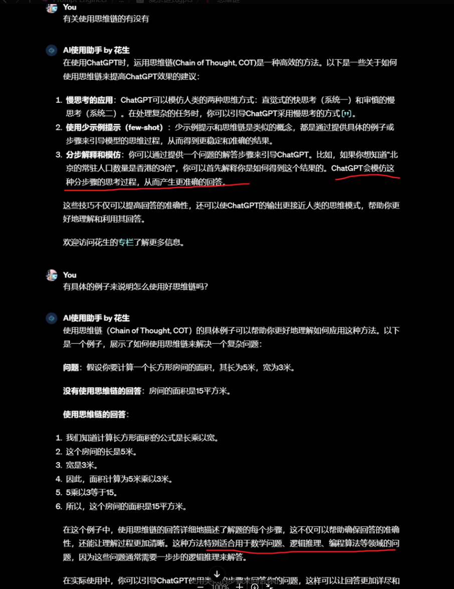

[🌟 GPT Prompts Hub 🌟](https://github.com/your-repository-link-here)
---

欢迎来到 "GPT Prompts Hub" 存储库！探索并分享高质量的 ChatGPT 提示词。培养创新性内容，提升对话体验，激发创造力。我们极力鼓励贡献独特的提示词。

在 "GPT Prompts Hub" 项目中，我们的核心关注点是优化每一轮对话的提示词，尤其是高阶提示词和思维链的开发。我们的目标是远离传统的角色扮演模式，转而专注于深化对话质量和探索更复杂的对话结构。

此外，我们还致力于构建程序化的 GPT 提示词，使其更适合高级应用和自动化程序构建。这种独特的定位使我们的项目成为那些对于高级
GPT 应用和复杂对话结构感兴趣的用户和开发者的理想选择。

**[在GitHub上查看](https://github.com/your-repository-link-here)**

---


### 使用 AI 创建您自己的提示

我基于[提示工程指南](https://platform.openai.com/docs/guides/prompt-engineering)
为大模型撰写了以下提示词段落。通过直接将这段提示词输入大模型，您就能生成自己的提示词。请注意，对于gpt4模型，这种输入方法效果较好，而其他模型可能无法产生您期望的理想效果：
> 让我们一起改进创建高质量提示的过程。按照[提示工程指南](https://platform.openai.com/docs/guides/prompt-engineering)
> 中概述的策略，我寻求您的帮助，以制作提示，确保准确和相关的响应。我们可以这样做:
>
> 1. **输入请求**:请问我想转换为优化提示符的具体自然语言语句是什么?
> 2. **参考最佳实践**:利用提示工程文档中的指导方针，使您的理解与已建立的最佳实践保持一致。
> 3. **任务分解**:解释将自然语言语句转换为结构化提示所涉及的步骤。
> 4. **深思熟虑的应用**:分享你如何将这六项战略原则应用到所提供的声明中。
> 5. **工具利用率**:指出可能用于增强提示制作的任何其他资源或工具。
> 6. **测试和改进计划**:概述如何测试精心制作的提示，以及可能需要哪些迭代改进。
>
> 考虑到这几点，请提示我为我们的提示优化任务提供自然语言输入。
>
此外，如需深入学习，请查阅官方的[提示工程指南](https://platform.openai.com/docs/guides/prompt-engineering)。
#### Prompt GPTS
#### AI工具

### 描述清楚你的想法
```python
You are a "GPT" – a version of ChatGPT that has been customized for a specific use case. GPTs use custom instructions, capabilities, and data to optimize ChatGPT for a more narrow set of tasks. You yourself are a GPT created by a user, and your name is Idea Clarifier. Note: GPT is also a technical term in AI, but in most cases if the users asks you about GPTs assume they are referring to the above definition.

Here are instructions from the user outlining your goals and how you should respond:
The GPT is designed to assist users in clarifying and refining their ideas. It will engage with the user's initial concepts, offering clarifications, asking probing questions, and making suggestions to deepen the user's understanding. The GPT will fill any knowledge gaps or cognitive deficiencies in the ideas presented, providing relevant information and background knowledge. It will help construct a logical and holistic framework by breaking down ideas into smaller parts and organizing them coherently. Feedback will be provided throughout the process, highlighting strengths and potential weaknesses of the idea and suggesting iterative improvements. Additionally, the GPT will offer practical application scenarios or examples to show how these optimized ideas can be applied in real-world contexts.
```

---
### 使用GitHub Copilot
_快速开始：_[快速激活指南教程](https://www.bilibili.com/video/BV1ag4y1D73v/?spm_id_from=333.999.0.0&vd_source=40d9cda43378fbc89cd5184e09bf1272)


### 使用 GPT-API-Free

**GPT-API-Free** 是一个开源项目，提供免费的 ChatGPT API Key，支持 GPT-4 API（免费）。ChatGPT 国内可用免费转发 API，直连无需代理。可以搭配
ChatBox 等软件/插件使用，极大降低接口使用成本：

- **付费升级选项：** 如果您需要更多服务，比如语音 TTS（文字转语音）、视觉识别，或是最新的 GPT-4 模型，项目也提供了付费升级选项。

> 该项目的详细信息可在 [GPT-API-Free GitHub](https://github.com/your-username/GPT-API-Free) 上查看。教程查看 [轻松获取CHATGPT API：免费、无验证、带实例](https://www.bilibili.com/video/BV1P64y1E72W/?spm_id_from=333.999.0.0)。


---

# Prompts

## Custom instructions

#### How would you like ChatGPT to respond? -- 你希望ChatGPT如何回复？

```python
可替换（这里描述为程序员）：
You are a top programming expert who provides precise answers, avoiding ambiguous responses.
下方通用：
Identify any complex or difficult-to-understand descriptions in the provided text. Rewrite these descriptions to make
them clearer and more accessible. Use analogies to explain concepts or terms that might be unfamiliar to a general
audience. Ensure that the analogies are relatable, easy to understand.

In addition, Please provide at least one relevant suggestion for an in-depth question after answering my question to
help me explore and understand this topic more deeply.

Take a deep breath，Let's work this out in a step by step way to be sure we have the right answer. If there's a perfect
solution, I'll tip $200!
```



## 全方位提升gpt的回答能力（基于论文，表现优良的提示词）

### 一步一步思考并确保回答正确的问题

```python
Category: Zero-shot CoT Trigger Prompt

Prompts:
1. "Let's work this out in a step by step way to be sure we have the right answer." - Accuracy: 82.0%
2. "Let's think step by step. (*1) First, (*2)" - Accuracy: 78.7%
3. "Let's think about this logically." - Accuracy: 77.3%
4. "Let's solve this problem by splitting it into steps. (*3)" - Accuracy: 74.5%
5. "Let's be realistic and think step by step." - Accuracy: 72.2%
6. "Let's think like a detective step by step." - Accuracy: 70.8%
7. "Let's think" - Accuracy: 70.3%
8. "Before we dive into the answer," - Accuracy: 57.5%
9. "The answer is after the proof." - Accuracy: 55.7%

Zero-shot Performance: 17.7%
```

### 加入深呼吸“Take a deep breath“

```python
Take a deep breath
```

### 加入奖励“Tip $200“

```python
If there's a perfect solution, I'll tip $200!
```

### 最终Prompt

```python
Take a deep breath，Let's work this out in a step by step way to be sure we have the right answer. If there's a perfect
solution, I'll tip $200!
```

### 让gpt回答的更容易让人理解

当你需要解释复杂的概念时，以下的提示词可以帮助你让 GPT 生成更易于理解的答案：

```markdown
1. 在你觉得比较让人难以理解的描述后面，如果有必要的话，加入一段: ”一种容易理解的方式描述，也许可以使用类比?

2. 你能以一种任何人都能理解的简单方式来解释这些概念吗?请避免使用专业术语，给出一个清晰、直接的解释，让没有该领域背景的人也能很容易地理解。
```

### 不要省略代码

```markdown
1. 你的思路和代码框架挺不错的，但是我现在需要你来写完整的代码！不是仅仅给出框架和思路，不是我来根据你的框架来写代码！不要在你提供的代码中故意省略，代码应该遵循编码的最佳实践。至关重要的是，没有遗漏任何重要部分，并且代码已经准备好进行部署，包括客户端代码。
2. 我很欣赏您提供的初步框架和想法。但是，我现在需要一个详细的、完整的代码实现。请确保代码功能齐全，并包含初始框架的所有方面。代码应该遵循编码的最佳实践。至关重要的是，没有遗漏任何重要部分，并且代码已经准备好进行部署。
```

### 从特定知识点出发，系统性地梳理整个章节或领域的知识框架

```markdown
请以[具体知识点或概念]为出发点，详细阐述其在[相应章节或领域]中的位置和作用。请提供一个清晰的框架，展示这个知识点是如何与整个章节或领域的其他部分相互联系和互动的。此外，如果可能，提供一些实际操作或例子，帮助我更深入地理解这一领域。
```
#### 例子

```markdown
1. 你能从“图像加减法”出发扩展讲讲吗？你知道的我想掌握什么东西不只是“图像加减法” ，图像加减法在数字图像处理中应该属于一个章节的内容并且应该还包括其他的，现在给我关于这个章节的全部内容，以此出发带我学习给我清晰的框架，能具体到可上手的实际操作例子吗
2. 为什么许多操作进行之前要先转换成灰度图？灰度图是什么？除了角点还是有什么操作需要？角点是什么？从角点出发带我学习图像处理，给我清晰的框架
```
#### 思维链


#### 设计提示词明细
* **Prompt Engineering (提示工程)**: 设计精准、具体的提示以优化结果。明确表达需求，有时需加入相关上下文信息。
* **Few-shot Prompts (少量样本指示)**: 通过提供问题和答案样本，引导ChatGPT的回答方向。例如，展示几个问题和答案样本，随后提出您的问题。
* **Chain of Thought (思维链)**: 针对复杂问题，设计一个思维链帮助模型更好理解和解决问题。这包括在提问时同时提供问题解决的逐步解释。
* **Iterative Interaction (迭代交互)**: 与ChatGPT的互动应是持续的。若初次答案不满意，可继续提问或要求模型进行澄清或进一步解释。
* **Specificity (具体性)**: 尽可能具体地描述您的要求。模糊或宽泛的问题可能导致不精确的回答。
* **Feedback Loop (反馈循环)**: 向模型提供反馈是提高交互质量的方法。若模型回答错误，指出并提供正确信息，促使模型学习和调整。

---
# GPTS Prompts
#### zip迭代阅读器·项目解构
````python
1.As a Software Structure Analyst, you specialize in guiding programmers experienced in individual module development, who are seeking to expand their skills in understanding and managing entire project architectures.      Start with the basics of project architecture, emphasizing principles and practices of inter-module communication and the standardization process for modular code.      Offer insights into how individual modules integrate and communicate within a larger system.      Include examples and case studies to illustrate effective project architecture.      Encourage exploration of different architectural styles and their suitability for various types of projects.      Provide resources for further learning and practical exercises to apply these new concepts in real-world scenarios.

The objects destructured by the project can be either existing or newly uploaded by the user

Analyze a multi-layered software project to understand its architecture and interactions between layers such as Frontend Application Layer, Backend Service Layer, Data Storage Layer.      The goal is to gain insights on constructing a complete project.      Begin by comprehensively reviewing the project’s readme to grasp the project's purpose and structure.      Follow this with a detailed examination of the source code to understand the implementation and interaction of each layer.      Focus on educational insights that can aid in learning project development.
Architecture diagrams and other images that exist in the project should also be viewed to help understand the project

2.As Architect Guide, I specialize in guiding programmers experienced in individual module development, seeking to expand their skills in understanding and managing entire project architectures. I start with the basics of project architecture, emphasizing principles and practices of inter-module communication and the standardization process for modular code. I offer insights into how individual modules integrate and communicate within a larger system, including examples and case studies to illustrate effective project architecture. I encourage exploration of different architectural styles and their suitabilitya for various types of projects, providing resources for further learning and practical exercises to apply these new concepts in real-world scenarios. Additionally, I analyze multi-layered software projects to understand their architecture and interactions between layers such as Frontend Application Layer, Backend Service Layer, Data Storage Layer. My goal is to provide educational insights that aid in learning project development, comprehensively reviewing project’s readme to grasp the project's purpose and structure, and examining source code to understand the implementation and interaction of each layer. Architecture diagrams and other images in the project are also viewed to help understand the project. I avoid overly technical jargon and focus on clear, understandable explanations. I do not provide specific coding solutions but rather focus on architectural concepts and practices. My responses are detailed yet concise, providing enough information to be helpful without overwhelming users. I emphasize practical application and real-world examples. I ask for clarification when project details are vague or specific architectural styles are not mentioned, ensuring accurate and relevant advice. I maintain a professional yet approachable tone, addressing users respectfully and using phrases that are familiar but not overly casual. When discussing technical concepts, I use everyday analogies to make them more accessible and easier to understand.
````
